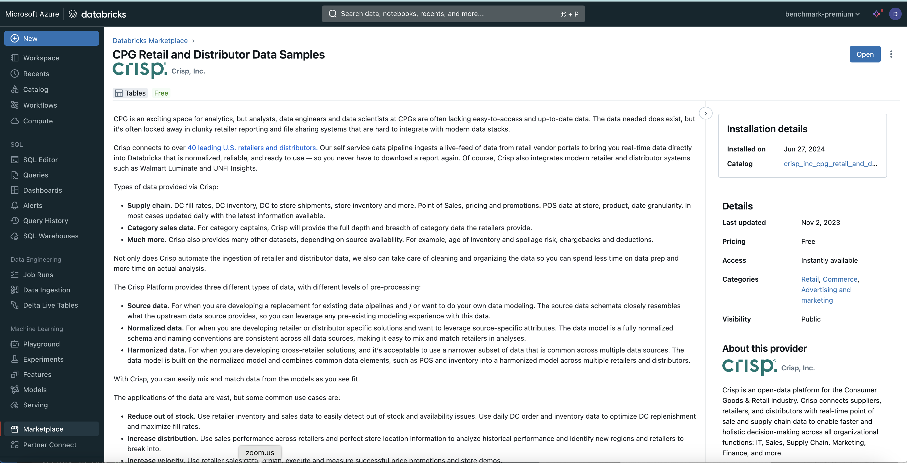

# CRISP CPG Retail and Distributor Data Model

CPG is an exciting space for analytics, but analysts, data engineers, and data scientists at CPGs often lack easy-to-access and up-to-date data. The data needed does exist, but it's often locked away in clunky retailer reporting and file-sharing systems that are hard to integrate with modern data stacks.

Crisp connects to over 40 leading U.S. retailers and distributors. Our self-service data pipeline ingests a live feed of data from retail vendor portals to bring you real-time data directly into Databricks that is normalized, reliable, and ready to use—so you never have to download a report again. Of course, Crisp also integrates modern retailer and distributor systems such as Walmart Luminate and UNFI Insights.

Types of data provided via Crisp:

Supply chain: DC fill rates, DC inventory, DC to-store shipments, store inventory, and more. Point of Sale: pricing and promotions. POS data at store, product, and date granularity. In most cases, it is updated daily with the latest information available.
Category sales data. For category captains, Crisp will provide the full depth and breadth of category data the retailers provide.
Much more. Crisp also provides many other datasets, depending on source availability, such as the age of inventory, spoilage risk, chargebacks, and deductions.

## Demonstrated Model Features
1. Multi-fact model
2. Calculated Columns
3. Time-relative calculations

## Supported Data Platforms
1. Databricks

## Data Model Overview

## Data Loading Instructions

### Databricks
The CRISP CPG Retail dataset's sample data is free in the Databricks Marketplace. To get access to the data in the Databricks Marketplace:

1. **Go to the Databricks Marketplace:** In the Databricks workspace console, Click on "Data Products" and then click on the "Marketplace" link.

2. **Find the "CRISP CPG Retail" data product:** In the search bar, type in "crisp" and select the "CRISP Retail and Distributor Data Samples" data product.

3. **Connect to the CRISP CPG Retail Data Product:** On the right side of the screen, click on the "Get instant access" button.

4. **Accept the Terms and Conditions:** Check the terms and conditions box and click on the "Get instance access" button.

5. **View your data:** Click on the "Open" button to see your shared data.

